# League of Legends Data Analytics
*DataTalks.Club's Data Engineering Zoomcamp Project*


- [League of Legends Data Analytics](#league-of-legends-data-analytics)
  - [Project Overview](#project-overview)
  - [Dataset](#dataset)
    - [League of Legends Public API](#league-of-legends-public-api)
    - [Data Dragon](#data-dragon)
  - [Technologies/Tools Used](#technologiestools-used)
  - [Project Directory Details](#project-directory-details)
  - [How does the Complete ETL process work?](#how-does-the-complete-etl-process-work)
    - [Prefect Flow](#prefect-flow)
    - [Logical Directories of File System](#logical-directories-of-file-system)
    - [Databricks Spark](#databricks-spark)
    - [DBT-Databricks](#dbt-databricks)
    - [PowerBi](#powerbi)
- [Reproduction Step](#reproduction-step)
  - [Setting Up](#setting-up)
    - [Clone the repository](#clone-the-repository)
    - [Installing Packages](#installing-packages)
    - [Application Installation](#application-installation)
    - [Configuring your Microsoft Azure Services](#configuring-your-microsoft-azure-services)
    - [Provisioning your Cloud Services](#provisioning-your-cloud-services)
    - [Obtaining your Riot API key](#obtaining-your-riot-api-key)
    - [Setting Up Prefect Cloud](#setting-up-prefect-cloud)
    - [Setting Up Dbt Cloud](#setting-up-dbt-cloud)
    - [Setting Up Azure Databricks Workspace](#setting-up-azure-databricks-workspace)
    - [Configuring your credentials](#configuring-your-credentials)
      - [Riot API Keys](#riot-api-keys)
      - [Azure Blob Storage](#azure-blob-storage)
      - [Prefect](#prefect)
      - [Databricks/Spark](#databricksspark)
  - [Reproducing the entire ETL Pipeline](#reproducing-the-entire-etl-pipeline)
    - [Prefect](#prefect-1)
      - [Deploying `all_flows:etl_per_league` to Prefect](#deploying-all_flowsetl_per_league-to-prefect)
      - [Deploying `all_flows:all_league` to Prefect](#deploying-all_flowsall_league-to-prefect)
      - [Deploying `league_assets:get_league_assets` to Prefect](#deploying-league_assetsget_league_assets-to-prefect)
      - [Running the flow](#running-the-flow)
    - [Databricks](#databricks)
    - [DBT](#dbt)
    - [PowerBi](#powerbi-1)
      - [Basics of PowerBi](#basics-of-powerbi)
      - [Page 1: Champion Picks and Bans](#page-1-champion-picks-and-bans)
      - [Page 2 : Item Analysis](#page-2--item-analysis)
      - [Page 3 : Champion Mastery](#page-3--champion-mastery)
      - [Page 4 : Champion Rune Picks](#page-4--champion-rune-picks)
      - [If you want to use your own Dataset](#if-you-want-to-use-your-own-dataset)
- [Future Improvements](#future-improvements)


## Project Overview
The League of Legends Analytics is a software-based project aimed at providing users with current trends in gameplay such as champion picks, bans, and other important statistics to help them make informed decisions about their gameplay strategies improve their skills. The project is designed to help both casual and competitive players, offering valuable insights that can benefit players at all skill levels. For example, casual players can use the data to experiment with new champions and strategies, while competitive players can use the insights to optimize their gameplay and stay ahead of the competition.

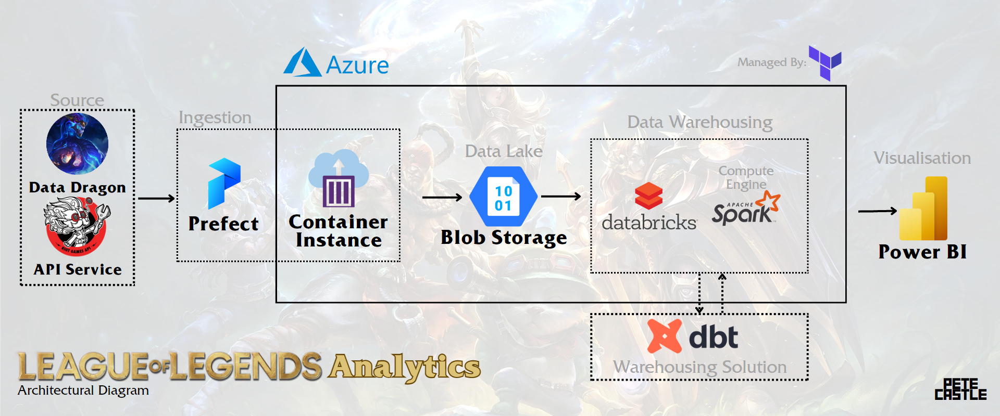

The project uses an extract, transform, and load (ETL) model and the League of Legends public API to obtain player data, including match results and league details.
To ensure efficient workflow orchestration, the project utilizes different tools such as dbt and Prefect. For cloud storage and programming, Azure services including Blob Storage and Databricks are utilized. All extracted data will be analyzed using PowerBi and the results will be made publicly available to users via the website.

League of Legends (LoL) is a highly popular multiplayer online battle arena (MOBA) game, which involves two teams of five players each battling against each other to destroy the opposing team's base. As the game continues to grow in popularity, more players are looking to improve their performance and win more games. However, there is currently a lack of comprehensive analytics tools that provide insights into player performance and team strategies.

The absence of data-driven insights hinders players' ability to identify areas where they need to improve and develop new strategies that could help them win more games. Furthermore, this lack of analytics tools also makes it difficult for team managers and coaches to identify potential areas of improvement in their team's performance, which could affect their chances of winning tournaments and other competitions.

The League of Legends Analytics Website is expected to have a significant impact on the League of Legends community. By providing valuable insights and data-driven strategies, the project will help players improve their gameplay and advance in their competitive endeavors. Furthermore, the project will contribute to the overall growth of the League of Legends community by fostering a data-driven approach to gameplay and promoting collaboration among players.

**Disclaimer:**
*League of Legends Analytics is not endorsed by Riot Games and does not reflect the views or opinions of Riot Games or anyone officially involved in producing or managing Riot Games properties. Riot Games and all associated properties are trademarks or registered trademarks of Riot Games, Inc*

## Dataset
### [League of Legends Public API](https://developer.riotgames.com/apis)
The League of Legends Public API is a freely accessible interface that provides access to various data related to the popular online multiplayer game League of Legends. This API can be used to retrieve information on a wide range of topics related to League of Legends, including game statistics, player profiles, match histories, and more. The data is returned in JSON format, making it easy to work with programmatically. Some examples of the types of data that can be retrieved from the League of Legends Public API include player rankings, champion statistics, and match details.

### [Data Dragon](https://developer.riotgames.com/docs/lol)
Data Dragon is a resource provided by Riot Games, the developer of League of Legends, that contains all the game's static data. This includes data on champions, items, maps, and other game assets that do not change during gameplay. Data Dragon is available in the form of compressed JSON files, making it easy to download and process. The data contained within Data Dragon can be used for a wide range of purposes, such as building League of Legends-related applications or performing data analysis. Some examples of the types of data that can be found in Data Dragon include champion abilities, item attributes, and map layouts. <br> 
Not all static files can be found on the data dragon.  Some assets are obtained from [this GitHub repository](https://github.com/InFinity54/LoL_DDragon)

## Technologies/Tools Used
1. **Prefect** (*both local and cloud*) <br>
Prefect, an open-source workflow automation tool, was used to build, schedule, and monitor the **ETL pipelines**. With Prefect, it was possible to create and manage complex workflows that involved multiple steps and dependencies. Prefect workflows could be run on the local machine or deployed to the cloud using Prefect Cloud, which provided additional features such as a centralized dashboard for monitoring the workflows, automatic error handling, and the ability to scale the workflows dynamically.

2. **Azure Cloud** <br>
Azure Cloud is a **cloud computing platform** provided by Microsoft that offers a wide range of services and tools for building, deploying, and managing applications and services in the cloud. Azure Cloud can be compared to Google Cloud Platform, which is a cloud computing platform provided by Google.

3. **Azure Container Instance** <br>
Azure Container Instance is a service that allows you to **run Prefect deployments** as Docker containers in the cloud without having to manage virtual machines or orchestration services. Azure Container Instance can be compared to Cloud Run, a fully managed serverless container platform provided by Google.

4. **Azure Blob Storage** *and Data Lake Storage Gen 2* <br>
Azure Blob Storage is a scalable and highly available object storage service that allows you to **store and retrieve** large amounts of unstructured **data**, such as JSON files. Azure Blob Storage can be compared to Google Cloud Storage, which is a scalable and highly available object storage service provided by Google.

5. **Azure Databricks** <br>
Azure Databricks, a fast, easy, and collaborative Apache Spark-based analytics platform, was used for **data warehousing** with Spark 13.0 as the compute engine. With Azure Databricks, it was possible to easily process and analyze large amounts of data, build machine learning models, and create interactive dashboards. Azure Databricks can be compared to Google Big Query, a fully managed, petabyte-scale, and serverless data warehouse provided by Google.

6. **dbt Cloud** <br>
dbt Cloud, a cloud-based data transformation tool that allows **transformation** and management **of data using SQL**, was used for data warehousing solution.

7. **Terraform** <br>
Terraform, an open-source infrastructure as code (IAC) tool, was used to provision and **manage Azure Cloud resources** in a repeatable and automated way.

8. **Power BI** <br>
Power BI, a business analytics service provided by Microsoft, was used for data analytics to visualize and analyze data from a wide range of sources. Interactive dashboards and visualizations were created to gain insights from League of Legends data.   Power BI can be compared to Google Data Studio, a free and easy-to-use business intelligence and data visualization platform provided by Google.

## Project Directory Details
| File or Directory                        | Description                                                                                                                                                                                                                         |
|------------------------------------------|-------------------------------------------------------------------------------------------------------------------------------------------------------------------------------------------------------------------------------------|
| configs/                                 | A directory containing all non-sensitive settings in the project.                                                                                                                                                                   |
| configs/dataframe_config.json            | A JSON file listing all relevant, redundant, and irrelevant columns obtained during the ETL process.  I suggest not to modify this JSON to prevent errors in upstream tasks.                                                        |
| configs/flows_config.json                | A JSON file listing all settings related to League of Legends.                                                                                                                                                                      |
| credentials/credentials.json             | Sensitive settings that provides secure access to all cloud services.  Contains the following keys.                                                                                                                                 |
| databricks/create_tables_from_lake.ipynb | A notebook file which allows the importation of CSV (or parquet files in older versions) to the Data Warehouse using PySpark API.                                                                                                   |
| dbt/                                     | Project folder used by dbt cloud.                                                                                                                                                                                                   |
| dbt/macros/*.sql                         | All custom macros used by SQL models. Reusable code snippets that can be used to create custom SQL functions or perform common transformations on data.                                                                             |
| dbt/models/core/*.sql                    | All models used for data analytics. Defines a specific table or view in a data warehouse. A dbt model is typically used to transform, aggregate, or join data from different sources to create a single, coherent view of the data. |
| dbt/models/core/schema.yml               | Contains all schema, tests, and column definitions for all core models *TBA*.  Also includes source modes outside of dbt.                                                                                                           |
| dbt/models/staging/*.sql                 | All views (intermediate step) in terms of select columns as a succeeding step of loading data from Spark.                                                                                                                           |
| dbt/models/staging/schema.yml            | Contains all schema, tests, and column definitions for staging tables.                                                                                                                                                              |
| flows/                                   | All flows used by Prefect during ETL from league API, basic data transformation, and upload to data lake.                                                                                                                           |
| flows/api_ingestion/api_ingest.ipynb     | DEPRECATED.  Most likely to be removed soon.                                                                                                                                                                                        |
| flows/dependencies/api_requests.py       | Python file responsible for HTTP requests; handling concurrent requests; and API method extraction.                                                                                                                                 |
| flows/dependencies/dataframe_extras.py   | Python file for increased abstraction on certain Dataframe transformation.                                                                                                                                                          |
| flows/dependencies/league_entries.py     | Python file responsible for transforming JSON file obtained from Ranked Leagues API Method to flattened DataFrame.                                                                                                                  |
| flows/dependencies/match_entries.py      | Python file responsible for transforming JSON file obtained from Matches API Method to flattened DataFrame.                                                                                                                         |
| flows/dependencies/method_ingestion.py   | Python file as a method ingestion manager for Python files above.                                                                                                                                                                   |
| flows/all_flows.py                       | Python file as an-easy-to-use ETL flow for leagues, matches, player info, etc.  Has to methods:  ETL for all leagues, and ETL for each leagues.                                                                                     |
| flows/convert_parquet_to_csv.py          | Python file to convert all Parquet files to CSV.  This is due to the inability of Spark to convert Parquet columns when multiple files are read.                                                                                    |
| flows/league_assets.py                   | Python file as an ETL flow for LOL Data Dragon.                                                                                                                                                                                     |
| powerbi/main.pbix                        | The only data analytics file included in the project.                                                                                                                                                                               |
| resources/                               | Default save location for external resources                                                                                                                                                                                        |
| resources/images                         | Images only used for documentation purposes.                                                                                                                                                                                        |
| resources/datasets                       | Where all local tables, CSVs, or Parquet files are saved.                                                                                                                                                                           |
| terraform/                               | Terraform's project directory                                                                                                                                                                                                       |
| terraform/main.tf                        | Where all Azure Cloud services are managed as a code.                                                                                                                                                                               |
| *-depoyment.yaml                         | Deployment files created by Prefect.                                                                                                                                                                                                |
| *.md                                     | Contains all official documentation about this project.                                                                                                                                                                             |

## How does the Complete ETL process work?
The following is a simplified process on how ETL works from ingestion from API to storage in Azure Blob Storage:
### Prefect Flow
1. The program obtains the list of players for each leagues using the method [LEAGUE-V4](https://developer.riotgames.com/apis#league-v4)
2. For each player in the list of players (*or selected if sample size is imited*), the program obtains the Developer-Account-Bounded summonerId and other sets of unique Ids using the method [SUMMONER-V4](https://developer.riotgames.com/apis#summoner-v4)  These IDs will be then used later as a reference (mapping) to obtain other data.  This is required as Riot games have additional layer of security for protecting user data.
3. Using the list of player IDs, the champion mastery is obtained using the method [CHAMPION-MASTERY-V4](https://developer.riotgames.com/apis#champion-mastery-v4).
4. Using the list of player IDs, the match history of each player is obtained using the method [MATCH-V4](https://developer.riotgames.com/apis#match-v4). 
5. Lastly, for each matchIDs obtained from each payer, the match details are obtained using the method [MATCH-V4](https://developer.riotgames.com/apis#match-v4). This is the most expensive API call as it requires a lot of data to be obtained.  This is the reason why the program is designed to obtain the match history first, then the match details.  This is to avoid unnecessary API calls in case the match history is not available.
6. All of the data obtained from the API calls are transformed into mutiple tables then stored in Azure Blob Storage as a Parquet or CSV.
7. Similar step is also done in the Data Dragon files.
   
### Logical Directories of File System
* All data is saved in the Cloud directory `storage_container/resources` *base directory for tables*.
* Inside this folder, there are five subfolders which contains the fundamental tables of the database.  These are the following:
    * `champion_mastery` - contains the champion mastery data of each player
    * `match` - contains the match history of each player
      * `match/general` - contains the basic data of each match (match type and match duration)
      * `match/players` - contains player-related data within that match (champion picked, summoner spells, player's statistics)
      * `match/players_challenges` - initially part of `match/players`, but separated to decrease column count.  Simply tracks the amount of challenge points the player is earning per match.
      * `match/teams` - contains the team-related data within that match (team statistics, bans, team players)
    * `data_dragon` - contains the static data of League of Legends assets
    * `accounts` - contains the summoner data of each player, Developer-Account-Bounded IDs are already removed in this stage
    * `leagues` - contains the league data of each player
* For `match` and `leagues` folder, the data is further subdivided into `queue` type (e.g. `RANKED_SOLO_5x5`) then by `tier` (e.g. `challengerleagues`) then by `DIVISION` (e.g. `I`).  This is to allow faster querying of data.
* The `data_dragon` has its own distinct folders for each patch (e.g. `13.7.1`)
* The filenames of the tables are the date and time at which the table is uploaded to the Data to ensure that the table is not replaced when it is uploaded to Data Lake.
  
### Databricks Spark
* Data is loaded to Spark using the `spark.read` method.  The data is then transformed using Spark SQL and Spark Dataframe API.
```
leagues_df = spark.read.format("csv").option("header","true").load(f"wasbs://{blob_container}@{storage_account_name}.blob.core.windows.net/resources/leagues/*/*/*/*.csv")
spark.sql("DROP TABLE IF EXISTS leagues")
leagues_df.write.partitionBy("tier").mode("overwrite").saveAsTable("leagues")
```
* Notice that in this code snippet, multiple wildcards are used to load all data in the subdirectory.  It also grants future users to load data from different `tier` and `division` by simply changing the wildcard.
* The data is partitioned by `region` and `tier` to allow faster querying.  The data is also stored in a `delta` format to allow faster updates in the future.  Ordering the columns using `z-ordering` will be added in the future release.

### DBT-Databricks
* DBT is used to transform the data to the Data Warehouse.  The data is transformed using SQL and Jinja2 templating.
* DBT is directly connected to the Spark cluster using the `spark` adapter. 
* Project directory is in `./dbt` folder.
* Models in `./dbt/models/core` are final tables suitable for Data Analysis.
* Models in `./dbt/models/staging`are staging tables whose columns selected will be used for core tables.
* Macros in `./dbt/macros` are used to generate SQL code for the models in the form of Jinja2 templates.

### PowerBi
* PowerBi's data source comes from Databricks' Spark Adapter for PowerBi.
* The data is further transformed to include metrics *(measures and columns)* such as:
  * Win Rate
  * Ban Rate
  * Pick Rate
  * URL of champion or item
  * And many more


# Reproduction Step
## Setting Up

### Clone the repository
`git clone https://github.com/PeteCastle 2023-Data-Engineering-Zoomcamp-Project`

### Installing Packages
`pip install -r requirements.txt` <br>
*The list may be incomplete as I've manually searched for the packages.*

### Application Installation
* Install Terraform [here](https://developer.hashicorp.com/terraform/downloads)
* Install PowerBi [here](https://powerbi.microsoft.com/en-us/downloads/)
* Insta Azure CLI [here](https://learn.microsoft.com/en-us/cli/azure/).  This is a required dependency by Terraform

### Configuring your Microsoft Azure Services
1. Go to the Azure website at https://azure.microsoft.com and click the "Start free" button at the top of the page.
2. Sign in or create a Microsoft account.
3. Once you've completed the sign-up process, you will be taken to the Azure portal dashboard or click [this link](https://portal.azure.com/#home)
4. From the dashboard, search for "Subscriptions" from the search bar.  A subscription is a logical container used to provision resources in Azure.  
5. Click on the "Add" button to create a new subscription. Choose the subscription type you want to use. The free subscription option will give you access to a limited set of Azure services, but will be sufficient for most small projects.
6. Now that you have a subscription, you can configure the Azure CLI. To do this, open a terminal window and enter the following command: <br>
`az login`
7. `az account set --subscription <subscription_id>`
Replace <subscription_id> with the ID of the subscription you want to use, which you can find in the Azure portal under "Subscriptions".

### Provisioning your Cloud Services
1. From your CLI, `cd <YOUR_PROJECT_DIRECTORY>`
2. `cd ./terraform`
3. `terraform init`
4. `terraform plan`
5. `terraform apply`

**IMPORTANT NOTE:** Some service names have a global uniqueness constraint (such as Azure Storage Account).  If you encounter an error, you have to change the name of the service.  

### Obtaining your Riot API key
Riot API keys are needed to run this pipeline.  You can obtain your API key by following these steps:
1. Go to https://developer.riotgames.com/ and create an account. You can use your Riot account if you play League of Legends, Valorant, or any other Riot game.
2. Accept the terms of service and click on "Get Started" to create your API key.
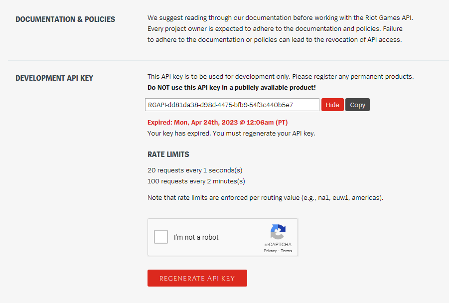
3. Generate your API key and save it in `./credentials/credentials.json`.  More on this later.
4. The more API keys, the merrier.  Note that the rate limits are 20 requests every 1 seconds(s) and 100 requests every 2 minutes(s). 
5. You have to refresh the API every 24 hours if you have Production API (default).

### Setting Up Prefect Cloud
1. Go to https://cloud.prefect.io/ and create an account.
2. Create a workspace of your choice.
3. Go to your CLI, and then enter `prefect cloud login`
4. You may either login in with a web browser (*easier*), or paste an API key.
5. Authorize the application
6. You'll be notified if the login is successful.
7. Go back to the webpage.  From the bottom left, open your account.  Then beside your profie icon, click on "Workspace Settings".
8. You'll see the command to set your workspace.  Copy the code and paste it in your CLI.
9.  Now all your flows are now run in the cloud.  You can check the status of your flows in the Prefect Cloud website.
Note: `prefect orion start` won't do anything as all flows are automatically run in the cloud, not locally.

### Setting Up Dbt Cloud
1. Go to https://cloud.getdbt.com/ and create an account.
2. A free tier allows you to run 1 job at a time.  You can upgrade to a paid tier if you want to run multiple jobs at a time.
3. Setup and name your project.
4. Choose `Databricks` as your connection type.
   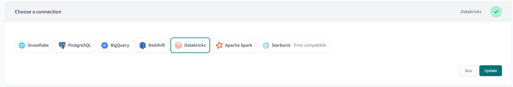
  * Choose `dbt-databricks` as your adapter.
  * The `Server Hostname` is the  `SPARK_MASTER_HOSTNAME` of your [credentials](#configuring-your-credentials)
  * The `HTTP Path` is the `SPARK_MASTER_HTTP_PATH` of your [credentials](#configuring-your-credentials)
  * The `Token` is the `DATABRICKS_ACCESS_TOKEN` of your [credentials](#configuring-your-credentials)
  * Leave other fields blank.
  * Test your connection.
5. Setup your repository by connecting your Github account and choosing your repository (not my respository).
6. Choose `dbt` as the project folder.

### Setting Up Azure Databricks Workspace
1. From Azure Portal, search for `Azure Databricks` and then select the service you've created.  Launch the Workspace from the Overview page.
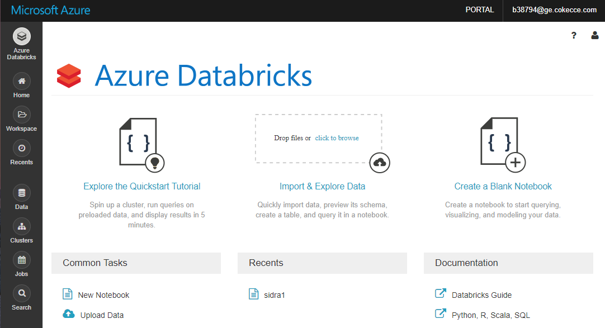
2.  Hover at the left side of the screen and cick `Repos`
3.  Add a repo to import your repo to the workspace
Note: You may need to manually transfer your credentials file to the Databricks Workspace since it is *gitignored*.

### Configuring your credentials
Credentials are needed to run the entire pipeline.  You credentials file are stored in `./credentias/credentials.json`.  The following is the sample structure of this JSON file.  The steps on obtaining them is presented after the JSON structure.

```
{
    "API_KEYS" : [
        "RGAPI-abcd123456-random-letters-and-numbers-0",
        "RGAPI-abcd123456-random-letters-and-numbers-1",
        "RGAPI-abcd123456-random-letters-and-numbers-2",
        "RGAPI-abcd123456-random-letters-and-numbers-3",
    ],
    "AZURE_BLOB_STORAGE_CREDENTIALS" : "DefaultEndpointsProtocol=https;AccountName={YOUR_ACCOUNT_NAME};AccountKey={YOUR_ACCOUNT_KEY};EndpointSuffix=core.windows.net",
    "AZURE_BLOB_STORAGE_KEY" : "{YOUR_ACCOUNT_KEY}",
    "AZURE_BLOB_CONTAINER" : "{STORAGE_CONTAINER_NAME}",
    "AZURE_BLOB_PROJECT_NAME": "{STORAGE_NAME}",
    "PREFECT_API_KEY" : "pnu_random_letters_and_numbers",
    "PREFECT_API_URL" : "https://api.prefect.cloud/api/accounts/{ACCOUNT_ID}/workspaces/{WORKSPACE_ID}",
    "DATABRICKS_ACCESS_TOKEN" : "dapia1234randomnumbers",
    "SPARK_MASTER_HOSTNAME" : "https://adb-randomnumbers.69.azuredatabricks.net",
    "SPARK_MASTER_PORT" : "443",
    "SPARK_MASTER_HTTP_PATH" : "sql/protocolv1/o/this-is-databricks-id/this-is-the-custer-id",
    "DATABRICKS_CLUSTER_ID" : "random-letters-and-numbers"
}
```

#### Riot API Keys 
`API_KEYS` <br>
Already stated in [Obtaining your Riot API key](#obtaining-your-riot-api-key)
#### Azure Blob Storage
From Azure Portal, search for `Storage Accounts`
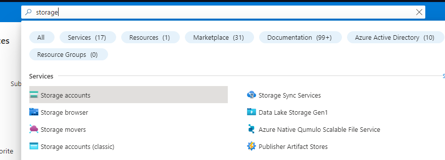
Cick the storage account of your choice
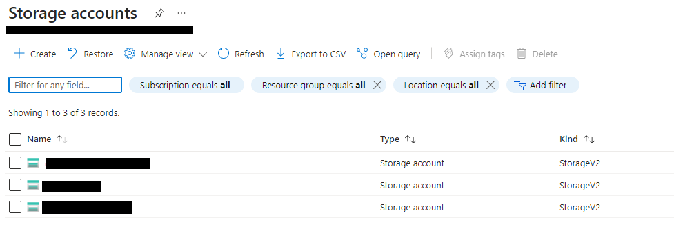
A window will pop up.  Click on `Access Keys`
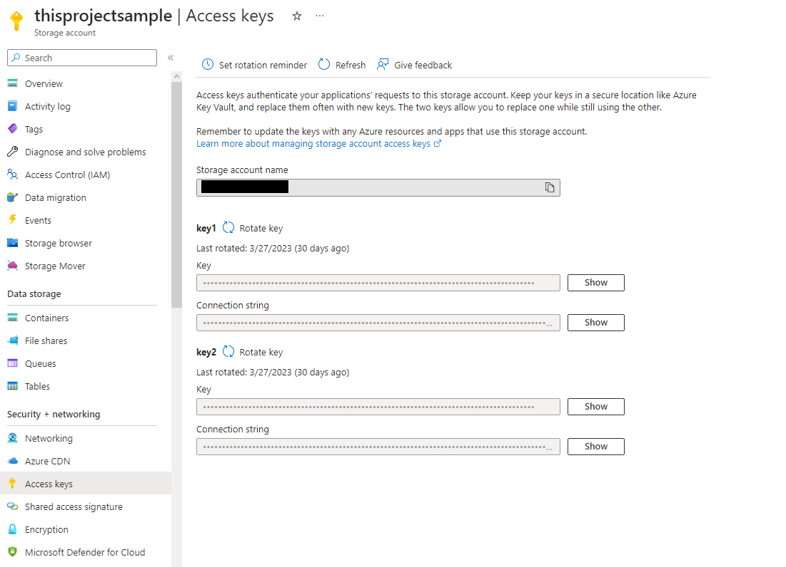

`AZURE_BLOB_STORAGE_CREDENTIALS` <br>
Your Blob Storage Credentials is the `Connection string` as shown in the image above.

`AZURE_BLOB_STORAGE_KEY` <br>
Your Storage Key is the `Key` attribute.

Now navigate to `Containers`
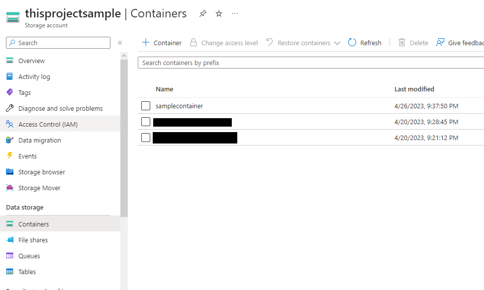

`AZURE_BLOB_CONTAINER` <br>
Your Blob Container is one of the `Name` attribute.  Based from the screenshot, it would be `samplecontainer`

`AZURE_BLOB_PROJECT_NAME` <br>
Your Blob Project Name is the in the header.  Based from the screenshot, it would be `thisprojectsample`

#### Prefect
`PREFECT_API_KEY` <br>
Your prefect API key is found in the Prefect Cloud website.  On the bottom left of the screen, click on your profile icon.  Then click on the Settings icon beside your name.  Select `API Keys`.  Create one, and copy the key.

`PREFECT_API_URL` <br>
1.  Go to your workspace.
2.  Notice the URL.  It would be something like `https://app.prefect.cloud/account/YOUR_ACCOUNT_ID/workspace/YOUR_WORKSPACE_ID/flow-runs`
3.  Your `PREFECT_API_URL` will be `https://api.prefect.cloud/api/accounts/YOUR_ACCOUNT_ID/workspaces/YOUR_WORKSPACE_ID/`
  
#### Databricks/Spark
From Azure Portal, search for `Azure Databricks` and then select the service you've created.  Launch the Workspace from the Overview page.


At the upper right side of the screen, click on your username -> User Settings 

`DATABRICKS_ACCESS_TOKEN`<br>
Your Access Token is found in the `Access Tokens` tab.  Click on `Generate New Token` and copy the token.
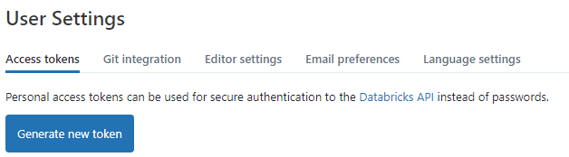

At the left side of the screen, hover then click on `Compute`.  Select the cluster you've created.  
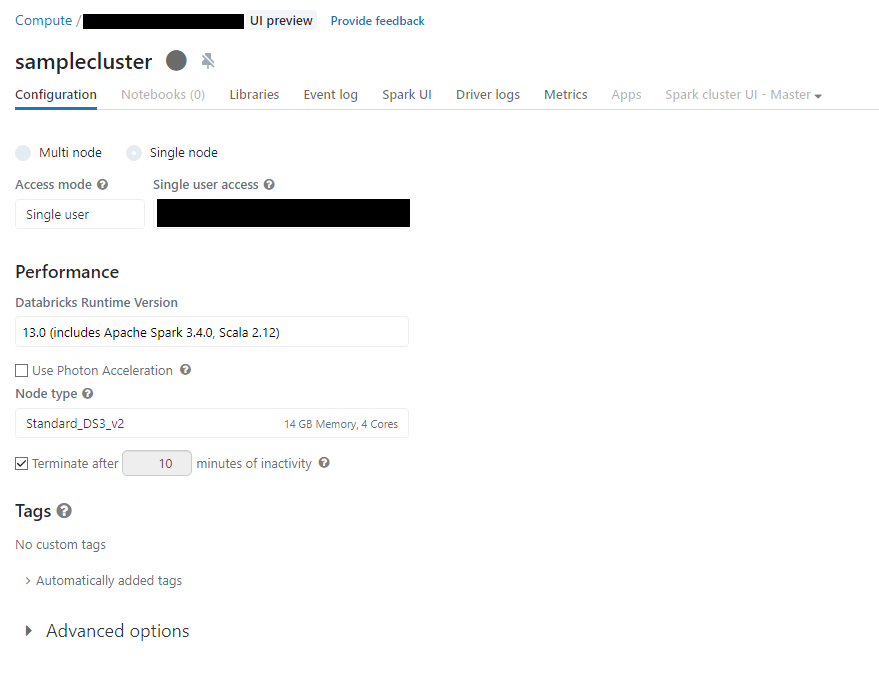

Click on `Advanced Options` then `JDBC/ODBC`

`SPARK_MASTER_HOSTNAME` <br>
Your Spark Master Hostname is the `Server Hostname` Attribute

`SPARK_MASTER_PORT` <br>
Your Spark Master Port is the `Port` Attribute

`SPARK_MASTER_HTTP_PATH` <br>
Your Spark Master HTTP Path is the `HTTP Path` Attribute

`DATABRICKS_CLUSTER_ID` <br>
Your Databricks Cluster ID is the series of numbers and letters after the backlash in the `HTTP Path` Attribute.
If your HTTP path is `sql/protocolv1/o/123456789/1244-678999-abcdef`, then the cluster ID is `1244-678999-abcdef`

## Reproducing the entire ETL Pipeline
### Prefect
#### Deploying `all_flows:etl_per_league` to Prefect
`cd {YOUR_PROJECT_DIR}`

`prefect deployment build ./flows/all_flows.py:etl_per_league --name="etl_all"`

(Optional) You may enter the following parameters in `etl_all-deployment.yaml` file:
```
parameters: {
    "queue": "RANKED_SOLO_5x5",
    "tier" : "challengerleagues",
    "division" : "I",
    "pages" : 1,
    "regions" : ["br1","eun1","euw1","jp1","kr","la1","la2","na1","oc1","tr1","ru","ph2","sg2","th2","tw2","vn2"],
    "ACCOUNT_INPUT_LIMIT" : 10000,
    "MATCH_INPUT_LIMIT" : 10000,
    "API_KEYS" : ["ENTER_YOUR_API_KEY_HERE remove this if you have api key set in credentials.json"], 
    "MAXIMUM_CONCURRENT_REQUESTS" : 500,
  }
```
Enter your API keys here OR in `./credentials/credentials.json' file.  The field is a list, so you can add more API keys if you want to hasten your API requests.  
Note, I HIGHLY suggest entering a field in `ACCOUNT_ONPUT_LIMITS` and `MATCH_INPUT_LIMITS`.  If you don't the program will query all accounts or matches that it receives from the API. For context: An API call from a league returns ~4000 accounts, and a match call from each account returns ~10 match by default.

`prefect deployment apply "etl_all-deployment.yaml"`

You should see this in your Prefect Cloud UI
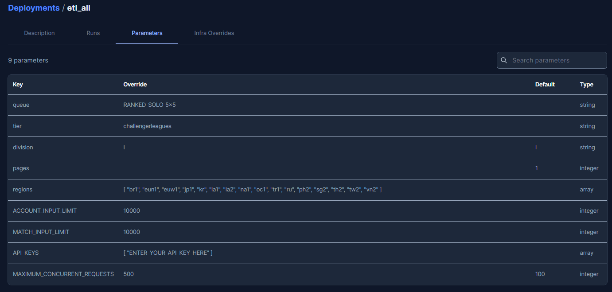

#### Deploying `all_flows:all_league` to Prefect

`prefect deployment build ./flows/all_flows.py:etl_all_league --name="etl_all"` <br>
Same parameters as above, but without the `tier` attribute since the program will ETL all tiers.

#### Deploying `league_assets:get_league_assets` to Prefect
`prefect deployment build ./flows/league_assets.py:get_league_assets --name="get_league_assets" --apply` <br>
No need for arguments since this is a static ETL.  This can be run once per League patch.

#### Running the flow
Go to Prefect cloud UI and run the flow.  You can also run the flow using the CLI: <br>
`prefect run flow --name "etl_all" --project "your-project-name"`

As well as the static files <br>
`prefect run flow --name "get_league_assets" --project "your-project-name"` <br>

Make sure to add an agent else nothing will happen
`prefect agent start default`

### Databricks
1. On your Databricks Workspace, hover on the left side of the screen to show `Repos` tab.
2. Click your repository.  
3. Open the file `./databricks/create_tables_from_lake`
4. Run the notebook.
   
### DBT
1. Go to your project's workspace.
2. At the browser's built-in CLI (bottom of the page)
3. Simply copy the following command `dbt build --full-refresh` and it will build all models in the project.
4. `dbt run` - will run all models in the project.

### PowerBi
* The PowerBi file is located in `./powerbi/League Data Analytics.pbix`
* For the end user, you may simply open the file and refresh the data to get the latest data from the Data Warehouse of the original author (me).
* If you don't want to download the file, you can access the analytics file via browser using this [link](https://app.powerbi.com/links/yk2s3lDuCz?ctid=c83f55a7-7fe8-4934-b759-09926430aef0&pbi_source=linkShare).  You may need to login your Microsoft account to view the file.

#### Basics of PowerBi
* PowerBi is a data visualization tool that allows users to create interactive dashboards and reports.
* It allows you to pick and filter data using slicers and filters by simply clicking on your desired data.
* There are multiple pages in the PowerBi file, each with its own purpose.

#### Page 1: Champion Picks and Bans
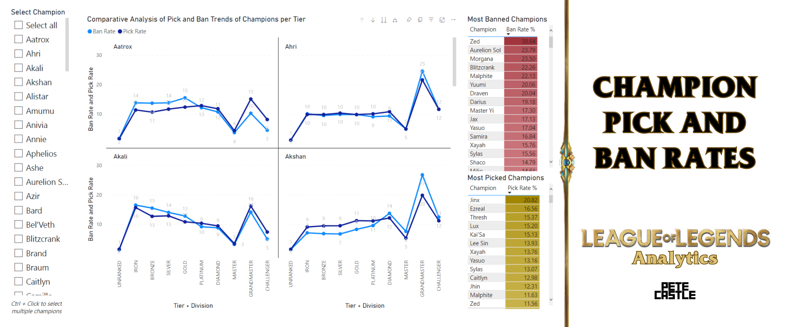
* This page shows the most picked and banned champions in the game.
* The left part of the screen allows you to filter or select the champion you want to see.  By default, all champions are shown.
* The middle part is a series of line graphs that allows you to see changes in pick and ban rates from Unranked to Challenger divisions.  You'll also see when the champion is picked more than banned, or vice versa.  The list of champions you'll see depends on what is selected on the left part of the screen.
* The right part is a table that shows the pick and ban rates of the selected champion overall.  The table is sorted in descending order of pick rate or ban rate.
  
#### Page 2 : Item Analysis
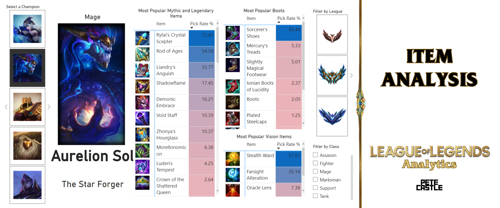
* This page shows the most picked items in the game per division.
* Just like in the previous page, the left part of the screen allows you to filter or select the champion you want to see.
* The champion's details are displayed.
* 3 tables with the most picked items is displayed.    These are: mythic and legendary, boots, and vision items.
* You can also filter the visuals by leagues so that you can see the most picked items in a specific league.

#### Page 3 : Champion Mastery
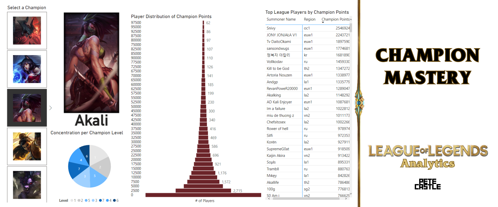
* This page shows the players' champion mastery.
* A players' champion mastery is the number of points a player has on a specific champion.  The more points a player has, the more experienced he is on that champion.
* The pie graph shows the percentage of people's mastery level.  Mastery level's in the game are one (*lowest*) and seven (*highest*).
* The pyramid graph shows the player distribution of champion points.  The y-axis is binned per 2500 points.  The x-axis is the number of players who belongs to that bin for that champion
* The closer the graph to an actual pyramid, the players are more evenly distributed.  The graph is also an indication of champion's play rate and popularity.
* The table on the right lists the top  players with the highest champion mastery points sorted by champion mastery points.

#### Page 4 : Champion Rune Picks
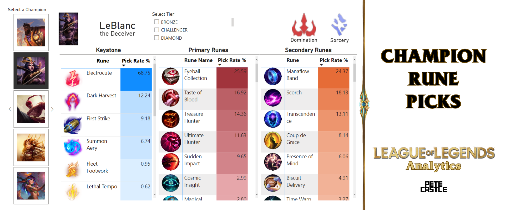
* This page shows the most picked runes per champion.
* The three tables shows the most picked keystone, primary, and secondary runes per champion. 
* The visual on the top right shows the most popular path per champion.  
* Like previous pages, you can filter the champion you want to see on the left part of the screen, as well as the desired tier of choice.

#### If you want to use your own Dataset
* Assuming that you've run all the models in the DBT, which is then stored in the Data Warehouse.
* Go to `Home` -> `Get Data` -> `Azure` -> `Azure Databricks`
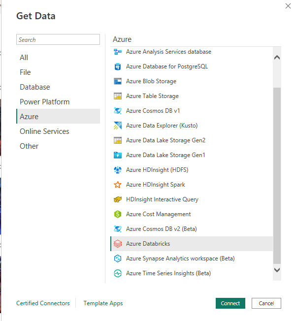
* Enter your `Server  Hostname` and `HTTP Path`.  You will be prompted to enter your `Access Token` if you haven't entered it in PowerBi before.
  * All of these can be found in your `./credentials/credentials.json` file

* A dialog box will appear, prompting you to chooce tables.
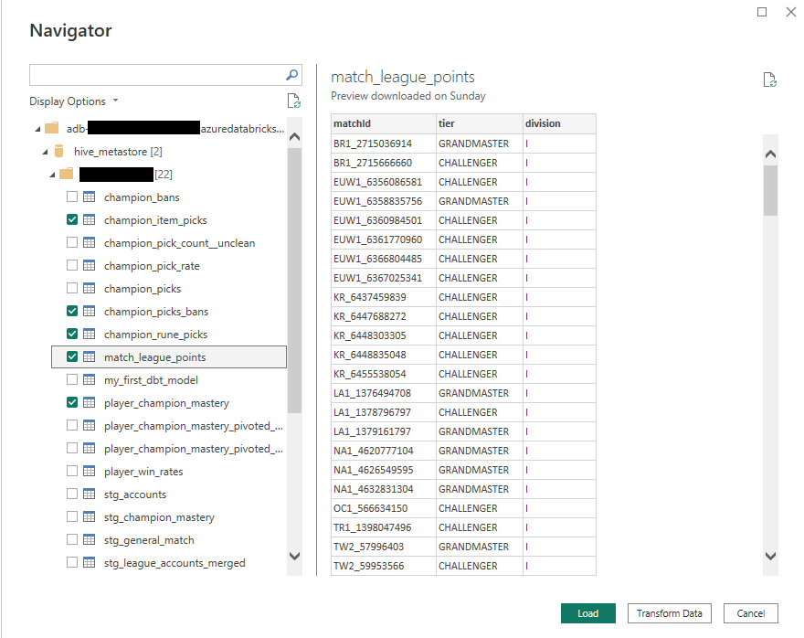
* Select the following tables *(other tables are used in intermediate transformation so they're not used in data presentation)*
  * `champion_item_picks`
  * `champion_picks_bans`
  * `champion_rune_picks`
  * `match_league_points`
  * `player_champion_mastery`
* The tables will now load.
* You will need to transform the data for each table by using `Power Query` and add `Measures`.  But is already out-of-scope for this project.

# Future Improvements
* Add more data in all tabes, but will need a `Production` Key in Riot's API to avoid rate limiting.
* Add more calculations in the DBT models to make the data more useful.
* Include other methods availabe in Riot API such as [/lol/match/v5/matches/{matchId}/timeline](https://developer.riotgames.com/apis#match-v5)
* Include an automated ETL process of payer data using Prefect's scheduler daily.  *The only reason why this is not implemented is that Production Apis needs to be reset everyday making automatic ETLs less desirable*
* Flows with increased flexibility.
* Try to integrate live-matches through Stream processing using Apache Kafka
* Add more visualizations in the PowerBi file. *Not all tables were used due to lack of time*

Thank you for checking out the League of Legends Analytics project! We hope you found the information and insights provided by our tool helpful in your quest to improve your performance on the Rift.

